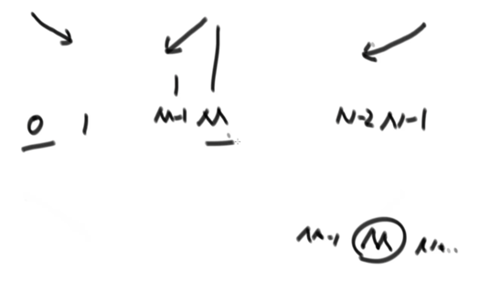

## 1. 复杂度和简单的排序算法

### 1.1 时间复杂度

常数操作：一个操作如果和样本的数据量没有关系，每次都是固定时间内完成的操作，叫做常数操作。

时间复杂度为一个算法流程中，常数操作数量的一个指标。常用O(读作big O)来表示。具体来说，先要对一个算法流程非常熟悉，然后去写出这个算法流程中，
发生了多少常数操作， 进而总结出常数操作数量的表达式。在表达式中，只要高阶项，不要低阶项，也不要高阶项的系数，剩下的部分如果为f(N)，那么时间复杂度为O(f(N))。

### 1.2 空间复杂度

如果算法执行所需要的临时空间不随着某个变量n的大小而变化，即此算法空间复杂度为一个常量，可表示为 S(n) = O(1)，反之则为O(n)

例如：
```java
int[] m = new int[n]
for(i=1; i<=n; ++i)
{
   j = i;
   j++;
}
```
这段代码中，第一行new了一个数组出来，这个数据占用的大小为n，这段代码的2-6行，虽然有循环，但没有再分配新的空间，因此，这段代码的空间复杂度主要看第一行即可，即 S(n) = O(n)

### 1.3 选择排序

思想：从左到右，便历每一个元素，再从该元素的下一个元素开始，便历每一个元素与其比较，如果后面元素小于前面，互换位置。

```go
package main

//正序
func selectSort(arr []int) []int {
	for i:=0;i<len(arr)-1;i++{
		for j:=i+1;j<len(arr);j++{
			if arr[j]<arr[i]{
				arr[i] = arr[j]
				arr[j] = arr[i]
            }
        }
    }
	return arr
}


```

### 1.4 冒泡排序

思想：从左到右，便历每一个元素与其下一个元素比较，后者大于前者，就互换位置。

```go
package main

//正序
func bubbleSort(arr []int) []int {
	for i:=0;i<len(arr)-1;i++{
		if arr[i]<arr[i+1]{
			arr[i] = arr[i+1]
			arr[i+1] = arr[i]
        }
    }
	return arr

}
```
### 1.5 异或

相同则为0，不同则为1。也可以理解为不进位的二进制相加。

公式：
（1）0^N = N
（2）N^N = 0
（3）满足交换律和结合律：a^b = b^c a^b^c = a^(b^c)
（4）N个数的异或结果与顺序无关：a^b^c = a^c^b = b^a^c = ...

#### 1.5.1 用位运算交换2个数的位置？

```go
a := 2
b := 3

a = a^b
b = a^b
a = a^b
```
思路：b = a^b^b = a^0 =a; a= a^b = a^b^a = b

#### 1.5.2 案例
- a.一个整数数组中，其中有一个数出现的次数为奇数个，其他均出现偶数次，找出这个出现次数为奇数的元素？

eor = a^b^c^d^... eor即为这个元素。
偶数次数的元素异或为0，0与任何数异或均为任何数，所以eor为这个数。

- b.其中有两个个数出现的次数为奇数个元素，其他均出现偶数次？找出这两个出现次数为奇数的元素？

分析：
所有元素位运算的结果eor := a^b（这2个元素的位运算结果），因为a!=b,所以eor !=0;
假设eor第8位字节为1（a和b第8个字节不同），找出第8位字节为1的所有元素位运算结果eor2 = a或者b;
eor ^ eor 2 = b或者a;

代码：
```go
package main

func findAB(arr []int) []int {
	eor := arr[0]
	for i:=1;i<len(arr);i++{
		eor ^= arr[i]
    }
	//eor必然有一个字节为1
	rightOne := eor ^ （~ eor + 1） //本身和本身的取反加1得到最右侧的1
	eor2 := 0
	for i:=0;i<len(arr);i++{
		if rightOne ^ arr[i] == 0 {
			eor2 ^= arr[i]//找出这个字节位置为1的所有数，因为其他数字为偶数个，只有a或者b为奇数个，所以eor2为a,或者b
        }
    }
	eor1 :=eor ^ eor2 
	return []int{eor1,eor2}
}
```

### 1.6 插入排序

思路：从第二个元素开始便历，当前元素与前面的元素比较，后者比前者大就交换位置，继续往前，直至到数组最前或者当前元素大于前面元素。

代码：
```go
package main

//正序
func InsertSort(arr []int) []int {
    for i:=1;i<len(arr);i++{
		j:=i
		for j>0 && arr[j]<arr[j-1]{
			swap(arr,j,j-1)
			j--
        }
    }
	return arr
}
func swap(arr []int,a,b int) []int {
    arr[a] = arr[a]^arr[b]
    arr[b] = arr[a]^arr[b]
    arr[a] = arr[a]^arr[b]
	return arr
}
```

### 1.7 二分法

二分法的时间复杂度：logN

#### 1.7.1 在一个有序数组里面找出是否存在某个数字？

```go
package main
func erFen(arr []int,a int) int {
    var midIndex int
	if len(arr)%2 != 0 {
		midIndex = (len(arr) -1) / 2
    }else{
		midIndex = len(arr) / 2
    }
	if arr[midIndex] == a {
		return midIndex
    }else if arr[midIndex] > a{
        return erFen(arr[0:midIndex],a)		
    }else{
		return erFen(arr[midIndex+1:len(arr)],a)
	}
}
```


#### 1.7.2 在一个有序数组里面找出>=某个数出现在数组最左侧的位置？

和上题类似

#### 1.7.3 无序数组的局部最小值问题？

局部最小：对于0位置数，arr[0]<arr[1],0就是局部最小；对于n-1位置数，如果arr[n-1]<arr[n-2],n局部最小；对于i位置，arr[i]<arr[i-1]&&arr[i]<arr[i+1],i局部最小。


### 1.8 递归

#### 1.8.1 剖析递归行为和递归行为时间复杂度的估算
#### 1.8.2 用递归方法找一个数组中的最大值，系统上到底是怎么做的?

```go
package main

func diGui(arr []int, i, j int) int {
	if i == j {
		return arr[i]
	}
	mid := i + (j-i)>>1
	leftMax := diGui(arr, i, mid)
	rightMax := diGui(arr, mid+1, j)
	
	bigInt := leftMax
	if leftMax < rightMax {
		bigInt = rightMax
    }
	return bigInt
}
```

master公式的使用：
```text
T(N) = a*T(N/b) + O(N^d)// T：子调用（a:子调用次数，N/b子调用的复杂度，子问题等规模）；O(Nd):除去子调用的时间复杂度
1) log(b,a) > d -> 复杂度为O(N^log(b,a)) 
2) log(b,a) = d -> 复杂度为O(N^d * logN)
3) log(b,a) < d -> 复杂度为O(N^d)
```

### 1.9 归并排序

思路：先一分为二，左侧排好序，右侧排好序，再两边merge.

```go
package main

func process(arr []int, i, j int) []int {
	if i == j {
		return arr
	}
	mid := i + (j-i)>>1
	process(arr, i, mid)
	process(arr, mid+1, j)
	merge(arr,i,mid,j)
	return arr
}

func merge(arr []int,i,mid,j int)  {
    newArr := make([]int,j-i+1)
	a:=0
	p1 := i
	p2 := mid +1
	for p1<=mid && p2 <= j {
		if arr[p1]>arr[p2]{
			newArr[a+1] = arr[p2+1]
        }else{
			newArr[a+1] = arr[p1+1]
        }
    }
	for p1<mid {
		newArr[a+1] = arr[p1+1]
    }
	for p2<j {
		newArr[a+1] = arr[p2+1]
	}
	for m:=0;m<len(newArr);m++{
		arr[i+m] = newArr[m]
    }
}
```

时间复杂度为O(N*logN),空间复杂度为O(N)。优于选择、冒泡、插入排序。原因是选择、冒泡和插入排序每次比较之后就丢弃，浪费了，但是归并排序每次比较会沿用下去。

#### 1.9.1 小和问题

- 问题：
在一个数组中，每一个数左边比当前数小的数累加起来，叫做这个数组的小和。求一个数组的小和。
- 例子:
[1,3,4,2,5] 1左边比1小的数，没有; 3左边比3小的数，1; 4左 边比4小的数，1、3; 2左边比2小的数，1; 5左边比5小的数，1、3、4、 2; 所以小和为1+1+3+1+1+3+4+2=16

- 思路：等同于一个数右边有几个数比他大。如上数组，比如3，右边有4，,5两个数比他大，就是2*3

- 代码：
```go
package main

func smallSum(arr []int) int {
    if len(arr) <2{
		return 0
    }
	return process(arr,0,len(arr)-1)
}
//arr[l...r]既要排好序，也要求小和
func process(arr []int,l,r int) int {
    if l==r {
		return 0
    }
	mid := l+((r-l)>>1)
	return process(arr,l,mid)+process(arr,mid+1,r)+merge(arr,l,mid,r)
}
func merge(arr []int,mid,l,r int) int {
    newArr := make([]int,r-l+1)
	i := 0
	p1 := l
	p2 := mid+1
	res := 0
	for p1<=mid && p2 <= r {
		if arr[p1]<arr[p2]{
			res += arr[p1]*(r-p2+1)
			newArr[i+1] = min(arr[p1+1],arr[p2+1])
        }
    }
	for p1 <= mid {
		newArr[i+1] = arr[p1+1]
    }
	for p2 <= r {
		newArr[i+1] = arr[p2+1]
    }
	for m:=0;m<len(newArr);m++ {
		arr[l+m] = newArr[m]
    }
	return res
}

func min(a,b int) int {
    if a<b{
		return a
    }else{
		return b
    }
}


```

#### 1.9.2 逆序对问题

在一个数组中，左边的数如果比右边的数大，则这两个数构成一个逆序对，请打印所有逆序对。

思路：和如上问题等同，改动点：

```go
if arr[p1]>arr[p2]{
	res += r-p2+1
}
```

### 1.10 荷兰国旗问题

#### 1.10.1 问题一

问题：给定一个数组arr，和一个数num，请把小于等于num的数放在数组的左边，大于num的数放在数组的右边。要求额外空间复杂度O(1)，时间复杂度O(N)

思路：
    （0）左侧划定一个小于num的区域
    （1）arr[i]<=num,arr[i]和小于num区域的下一个数交换，小于num区域右移，i++
    （2）arr[i]>num,i++
代码：

```go


```


#### 1.10.2 问题二(荷兰国旗问题)
问题：给定一个数组arr，和一个数num，请把小于num的数放在数组的左边，等于num的数放在数组的中间，大于num的数放在数组的右边。要求额外空间复杂度O(1)，时间复杂度 O(N)

思路：
（0）左侧划定一个小于num的区域，右侧划定一个大于num的区域。
（1）arr[i]<num,arr[i]和小于num区域的下一个数交换，小于num区域右移，i++
（1）arr[i]==num,++
（2）arr[i]>num,arr[i]和大于num的区域前的一个数交换，大于num的区域左移动。i原地不动

代码：


