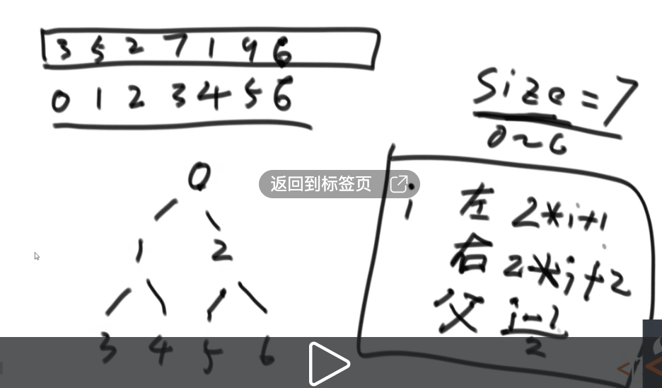
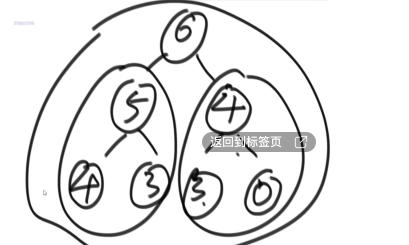

## 1. 复杂度和简单的排序算法

### 1.1 时间复杂度

常数操作：一个操作如果和样本的数据量没有关系，每次都是固定时间内完成的操作，叫做常数操作。

时间复杂度为一个算法流程中，常数操作数量的一个指标。常用O(读作big O)来表示。具体来说，先要对一个算法流程非常熟悉，然后去写出这个算法流程中，
发生了多少常数操作， 进而总结出常数操作数量的表达式。在表达式中，只要高阶项，不要低阶项，也不要高阶项的系数，剩下的部分如果为f(N)，那么时间复杂度为O(f(N))。

### 1.2 空间复杂度

如果算法执行所需要的临时空间不随着某个变量n的大小而变化，即此算法空间复杂度为一个常量，可表示为 S(n) = O(1)，反之则为O(n)

例如：
```java
int[] m = new int[n]
for(i=1; i<=n; ++i)
{
   j = i;
   j++;
}
```
这段代码中，第一行new了一个数组出来，这个数据占用的大小为n，这段代码的2-6行，虽然有循环，但没有再分配新的空间，因此，这段代码的空间复杂度主要看第一行即可，即 S(n) = O(n)

### 1.3 选择排序

思想：从左到右，便历每一个元素，再从该元素的下一个元素开始，便历每一个元素与其比较，如果后面元素小于前面，互换位置。

```go
package main

//正序
func selectSort(arr []int) []int {
	for i:=0;i<len(arr)-1;i++{
		for j:=i+1;j<len(arr);j++{
			if arr[j]<arr[i]{
				arr[i] = arr[j]
				arr[j] = arr[i]
            }
        }
    }
	return arr
}


```

### 1.4 冒泡排序

思想：从左到右，便历每一个元素与其下一个元素比较，后者大于前者，就互换位置。

```go
package main

//正序
func bubbleSort(arr []int) []int {
	for i:=0;i<len(arr)-1;i++{
		if arr[i]<arr[i+1]{
			arr[i] = arr[i+1]
			arr[i+1] = arr[i]
        }
    }
	return arr

}
```
### 1.5 异或

相同则为0，不同则为1。也可以理解为不进位的二进制相加。

公式：
（1）0^N = N
（2）N^N = 0
（3）满足交换律和结合律：a^b = b^c a^b^c = a^(b^c)
（4）N个数的异或结果与顺序无关：a^b^c = a^c^b = b^a^c = ...

#### 1.5.1 用位运算交换2个数的位置？

```go
a := 2
b := 3

a = a^b
b = a^b
a = a^b
```
思路：b = a^b^b = a^0 =a; a= a^b = a^b^a = b

#### 1.5.2 案例
- a.一个整数数组中，其中有一个数出现的次数为奇数个，其他均出现偶数次，找出这个出现次数为奇数的元素？

eor = a^b^c^d^... eor即为这个元素。
偶数次数的元素异或为0，0与任何数异或均为任何数，所以eor为这个数。

- b.其中有两个个数出现的次数为奇数个元素，其他均出现偶数次？找出这两个出现次数为奇数的元素？

分析：
所有元素位运算的结果eor := a^b（这2个元素的位运算结果），因为a!=b,所以eor !=0;
假设eor第8位字节为1（a和b第8个字节不同），找出第8位字节为1的所有元素位运算结果eor2 = a或者b;
eor ^ eor 2 = b或者a;

代码：
```go
package main

func findAB(arr []int) []int {
	eor := arr[0]
	for i:=1;i<len(arr);i++{
		eor ^= arr[i]
    }
	//eor必然有一个字节为1
	rightOne := eor ^ （~ eor + 1） //本身和本身的取反加1得到最右侧的1
	eor2 := 0
	for i:=0;i<len(arr);i++{
		if rightOne ^ arr[i] == 0 {
			eor2 ^= arr[i]//找出这个字节位置为1的所有数，因为其他数字为偶数个，只有a或者b为奇数个，所以eor2为a,或者b
        }
    }
	eor1 :=eor ^ eor2 
	return []int{eor1,eor2}
}
```

### 1.6 插入排序

思路：从第二个元素开始便历，当前元素与前面的元素比较，后者比前者大就交换位置，继续往前，直至到数组最前或者当前元素大于前面元素。

代码：
```go
package main

//正序
func InsertSort(arr []int) []int {
    for i:=1;i<len(arr);i++{
		j:=i
		for j>0 && arr[j]<arr[j-1]{
			swap(arr,j,j-1)
			j--
        }
    }
	return arr
}
func swap(arr []int,a,b int) []int {
    arr[a] = arr[a]^arr[b]
    arr[b] = arr[a]^arr[b]
    arr[a] = arr[a]^arr[b]
	return arr
}
```

### 1.7 二分法

二分法的时间复杂度：logN

#### 1.7.1 在一个有序数组里面找出是否存在某个数字？

```go
package main
func erFen(arr []int,a int) int {
    var midIndex int
	if len(arr)%2 != 0 {
		midIndex = (len(arr) -1) / 2
    }else{
		midIndex = len(arr) / 2
    }
	if arr[midIndex] == a {
		return midIndex
    }else if arr[midIndex] > a{
        return erFen(arr[0:midIndex],a)		
    }else{
		return erFen(arr[midIndex+1:len(arr)],a)
	}
}
```


#### 1.7.2 在一个有序数组里面找出>=某个数出现在数组最左侧的位置？

和上题类似

#### 1.7.3 无序数组的局部最小值问题？

局部最小：对于0位置数，arr[0]<arr[1],0就是局部最小；对于n-1位置数，如果arr[n-1]<arr[n-2],n局部最小；对于i位置，arr[i]<arr[i-1]&&arr[i]<arr[i+1],i局部最小。


### 1.8 递归

#### 1.8.1 剖析递归行为和递归行为时间复杂度的估算
#### 1.8.2 用递归方法找一个数组中的最大值，系统上到底是怎么做的?

```go
package main

func diGui(arr []int, i, j int) int {
	if i == j {
		return arr[i]
	}
	mid := i + (j-i)>>1
	leftMax := diGui(arr, i, mid)
	rightMax := diGui(arr, mid+1, j)
	
	bigInt := leftMax
	if leftMax < rightMax {
		bigInt = rightMax
    }
	return bigInt
}
```

master公式的使用：
```text
T(N) = a*T(N/b) + O(N^d)// T：子调用（a:子调用次数，N/b子调用的复杂度，子问题等规模）；O(Nd):除去子调用的时间复杂度
1) log(b,a) > d -> 复杂度为O(N^log(b,a)) 
2) log(b,a) = d -> 复杂度为O(N^d * logN)
3) log(b,a) < d -> 复杂度为O(N^d)
```

### 1.9 归并排序

思路：先一分为二，左侧排好序，右侧排好序，再两边merge.

```go
package main

func process(arr []int, i, j int) []int {
	if i == j {
		return arr
	}
	mid := i + (j-i)>>1
	process(arr, i, mid)
	process(arr, mid+1, j)
	merge(arr,i,mid,j)
	return arr
}

func merge(arr []int,i,mid,j int)  {
    newArr := make([]int,j-i+1)
	a:=0
	p1 := i
	p2 := mid +1
	for p1<=mid && p2 <= j {
		if arr[p1]>arr[p2]{
			newArr[a+1] = arr[p2+1]
        }else{
			newArr[a+1] = arr[p1+1]
        }
    }
	for p1<mid {
		newArr[a+1] = arr[p1+1]
    }
	for p2<j {
		newArr[a+1] = arr[p2+1]
	}
	for m:=0;m<len(newArr);m++{
		arr[i+m] = newArr[m]
    }
}
```

时间复杂度为O(N*logN),空间复杂度为O(N)。优于选择、冒泡、插入排序。原因是选择、冒泡和插入排序每次比较之后就丢弃，浪费了，但是归并排序每次比较会沿用下去。

#### 1.9.1 小和问题

- 问题：
在一个数组中，每一个数左边比当前数小的数累加起来，叫做这个数组的小和。求一个数组的小和。
- 例子:
[1,3,4,2,5] 1左边比1小的数，没有; 3左边比3小的数，1; 4左 边比4小的数，1、3; 2左边比2小的数，1; 5左边比5小的数，1、3、4、 2; 所以小和为1+1+3+1+1+3+4+2=16

- 思路：等同于一个数右边有几个数比他大。如上数组，比如3，右边有4，,5两个数比他大，就是2*3

- 代码：
```go
package main

func smallSum(arr []int) int {
    if len(arr) <2{
		return 0
    }
	return process(arr,0,len(arr)-1)
}
//arr[l...r]既要排好序，也要求小和
func process(arr []int,l,r int) int {
    if l==r {
		return 0
    }
	mid := l+((r-l)>>1)
	return process(arr,l,mid)+process(arr,mid+1,r)+merge(arr,l,mid,r)
}
func merge(arr []int,mid,l,r int) int {
    newArr := make([]int,r-l+1)
	i := 0
	p1 := l
	p2 := mid+1
	res := 0
	for p1<=mid && p2 <= r {
		if arr[p1]<arr[p2]{
			res += arr[p1]*(r-p2+1)
			newArr[i+1] = min(arr[p1+1],arr[p2+1])
        }
    }
	for p1 <= mid {
		newArr[i+1] = arr[p1+1]
    }
	for p2 <= r {
		newArr[i+1] = arr[p2+1]
    }
	for m:=0;m<len(newArr);m++ {
		arr[l+m] = newArr[m]
    }
	return res
}

func min(a,b int) int {
    if a<b{
		return a
    }else{
		return b
    }
}


```

#### 1.9.2 逆序对问题

在一个数组中，左边的数如果比右边的数大，则这两个数构成一个逆序对，请打印所有逆序对。

思路：和如上问题等同，改动点：

```go
if arr[p1]>arr[p2]{
	res += r-p2+1
}
```

### 1.10 快排

时间复杂度 O(n*logN)
空间复杂度O(logN)

#### 1.10.1 快排1.0版本

取数组最右边的元素(a)作为临界值，把数组中其他的数，小于等于a的放在最左边，大于a的数放在右边，再把a与大于a的第一个元素交换。
此时，再让a所在的新位置左侧和右侧数组重复上述行为递归。


问题：给定一个数组arr，和一个数num，请把小于等于num的数放在数组的左边，大于num的数放在数组的右边。要求额外空间复杂度O(1)，时间复杂度O(N)

思路：
    （0）左侧划定一个小于num的区域
    （1）arr[i]<=num,arr[i]和小于num区域的下一个数交换，小于num区域右移，i++
    （2）arr[i]>num,i++
代码：

```go


```

#### 1.10.2 快排2.0版本(荷兰国旗问题)

取数组最右边的元素(a)作为临界值，把数组中其他的数，小于a的放在最左边，等于a的放在中间，大于a的数放在右边，再把a与大于a的第一个元素交换。
此时，等于a的数不用动了，小于a的数组和大于a的数组重复以上操作递归。

复杂度：O(N^2)

问题：给定一个数组arr，和一个数num，请把小于num的数放在数组的左边，等于num的数放在数组的中间，大于num的数放在数组的右边。要求额外空间复杂度O(1)，时间复杂度 O(N)

思路：
（0）左侧划定一个小于num的区域，右侧划定一个大于num的区域。
（1）arr[i]<num,arr[i]和小于num区域的下一个数交换，小于num区域右移，i++
（1）arr[i]==num,++
（2）arr[i]>num,arr[i]和大于num的区域前的一个数交换，大于num的区域左移动。i原地不动

代码：

#### 1.10.3 快排3.0版本

思想：基于快排2.0版本，随机取一个数与数组最后一个数交换，再进行快排2.0的操作。

代码：

```go
package main

import "math"

func quickSort(arr []int) {
	if len(arr) < 2 {
		return
	}
	process(arr, 0, len(arr)-1)
}

//arr l-->r排序
func process(arr []int, l, r int) {
	//等概率选一个位置与末尾数交换
	if l < r {
		random := int(math.Round(float64((r-l+1)/len(arr)))) * len(arr) + l
		arr[random] = arr[random]^arr[r]
		arr[r] = arr[random]^arr[r]
		arr[random] = arr[random]^arr[r]
	}
	newArr := partition(arr,l,r)
	process(arr,l,newArr[0]-1)
	process(arr,newArr[1]+1,r)
}

//以arr[r]做划分，分为小于arr[r]区域，等于arr[r]区域，大于arr[r]区域
//返回等于划分值区域的左边界和右边界
func partition(arr []int, l, r int) []int {
    less := l-1//<区右边界
	more := r//>区左边界
	for l<more {
		if arr[l]<arr[r] {
			swap(arr,less+1,l)
			less ++
			l++
        }else if arr[l]>arr[r]{
			more --
			swap(arr,more,l)
        }else{
			l++
        }
    }
	swap(arr,more,r)
	return []int{less+1,more}
}

func swap(arr []int ,a,b int)  {
    arr[a] = arr[a]^arr[b]
    arr[b] = arr[a]^arr[b]
    arr[a] = arr[a]^arr[b]
	return
}

```

### 1.11 堆

#### 1.11.1 二叉树

满二叉树：二叉树存在右节点时，必定存在子节点。



i位置的左子节点是2*i+1
i位置的右子节点是2*i+2
i位置的父节点是(i-1)/2

二叉树的高度：
n个数的高度logN

#### 1.11.2 堆的介绍

大根堆：每个位置的头结点是整个树中最大的值。


小根堆：每个位置的头结点是整个树中最小的值。

heapSize = 节点个数
堆中最大的节点：头结点

#### 1.11.3 heapInsert

问题：数组接收一个数，使其形成一个新的堆？

思路：
    （1）heapSize加1，把新数放到堆尾的节点上。
    （2）和父节点比较，如果父节点比该数小就交换，以此类推，直至父节点比其大或者没有父节点了。

heapInsert代码：
```go
package main

func heapInsert(arr []int ,index int)  {
    for arr[index] > arr [(index -1) /2] {
		swap(arr,index,(index-1)/2)
		index = (index-1)/2
    }
}

func swap(arr []int,a,b int)  {
    arr[a] = arr[a] ^ arr[b]
    arr[b] = arr[a] ^ arr[b]
    arr[a] = arr[a] ^ arr[b]
}

```

#### 1.11.3 heapify

问题：如何取出大根堆的头结点？

思路：
    （1）取出头节点，把最后一个节点的数放在头结点上，heapSize减1。
    （2）然后把头结点的数和两个子节点中最大的数比较，比较大子节点还大就交换位置，以此操作，直至没有子节点或者比子节点都小。这个过程叫做heapify.

heapify代码:

```go
package main

func heapify(arr []int, index, heapSize int) {
	left := index*2 + 1
	for left < heapSize {
		//取出2个子节点中最大的节点位置
		biggerChild := left
		if left + 1 <heapSize && arr[left+1]>arr[left]{
			biggerChild = left +1
        }
		//把当前节点的数和子节点较大的数比较
		if arr[biggerChild] < arr[index]{
			biggerChild = index
        }
		if biggerChild == index {
			break
        }
		//交换位置
		swap(arr,biggerChild,index)
		index = biggerChild
		left = index * 2 +1
	}
}

func swap(arr []int,a,b int)  {
	arr[a] = arr[a] ^ arr[b]
	arr[b] = arr[a] ^ arr[b]
	arr[a] = arr[a] ^ arr[b]
}

```

综合：把一个连续区域内，把i位置的节点的数修改后，依然是堆？
思路：i位置数变小了，heapify过程；i位置数变大了，heapInsert过程。依然是堆结构。

#### 1.11.4 堆排序

思路：
1，先让整个数组都变成大根堆结构，建立堆的过程: 
    1)从上到下的方法，时间复杂度为O(N*logN) 
    2)从下到上的方法，时间复杂度为O(N)
2，把堆的最大值和堆末尾的值交换，然后减少堆的大小之后，再去调整堆，
3，一直周而复始，时间复杂度为O(N*logN) 3，堆的大小减小成0之后，排序完成

代码实现：

```go
package main

func heapSort(arr []int) {
	if len(arr)<2 {
		return
    }
	//把数组放入一个大根堆里面
	for i:=0;i<len(arr);i++ {
		heapInsert(arr,i)
    }
	heapSize := len(arr)
	//0位置的数和最后位置数交换
	swap(arr,0,heapSize-1)
	//再把0位置数heapSize
	for heapSize>0 {
		heapify(arr,0,heapSize)
		swap(arr,0,heapSize-1)
    }
}

func swap(arr []int,a,b int)  {
	arr[a] = arr[a] ^ arr[b]
	arr[b] = arr[a] ^ arr[b]
	arr[a] = arr[a] ^ arr[b]
}
```
#### 1.11.5 堆排序扩展

已知一个几乎有序的数组，几乎有序是指，如果把数组排好顺序的话，每个元素移动的距离可以不超过k，并且k相对于数组来说比较小。
请选择一个合适的排序算法针对这个数据进行排序。


说明：
    （1）数组转为小根堆：和大根堆方式相反。
    （2）使用堆结构有两种方式，一、自己构建的堆，可以更灵活使用。二、使用语言级的堆包，只有push和pop两种接口，不支持复杂操作。

代码实现：

```go
package main

import (
	"container/heap"
	"math"
)

type MyHeap []int

func (m MyHeap) Len() int {
	return len(m)
}

//如果实现大顶堆，则需要调整一下Less函数
func (m MyHeap) Less(i, j int) bool {
	if m[i] < m[j] {
		return true
	}
	return false
}

func (m MyHeap) Swap(i, j int) {
	m[i], m[j] = m[j], m[i]
}

func (m *MyHeap) Push(x any) {
	*m = append(*m, x.(int))
}

func (m *MyHeap) Pop() any {
	val := (*m)[len(*m)-1]
	*m = (*m)[:len(*m)-1]
	return val
}

func sortedArrDistanceLessK(arr []int, k int) {
	//默认小根堆
	h := &MyHeap{arr}
	heap.Init(h)
	index := 0
	for ;index <= int(math.Min(float64(len(arr)),float64(k)));index ++ {
		h.add(arr[index])
    }
	//从头开始弹出数字，然后把k后面一个数加在heap中去
	i :=0
	for ;index<len(arr);{
        h.add(arr[index])
		arr[i] = h.poll()
		i++
		index++
	}
	//再把heap中数字一次弹出
	for len(h)>0 {
		arr[i+1] = h.poll()
    }
}
```

#### 1.11.6 比较器

思想：
    （1）返回负数的时候，第一个参数排在前面
    （2）返回正数的时候，第二个参数排在前面
    （3）返回0的时候，谁在前面无所谓

使用：
    1)比较器的实质就是重载比较运算符 
    2)比较器可以很好的应用在特殊标准的排序上 
    3)比较器可以很好的应用在根据特殊标准排序的结构上

```go
package main

type Student struct {
	Id int `json:"id"`
	Name string `json:"name"`
}

func main()  {
    myStudent := []Student{
		{Id: 1,Name: "aa"},
		{Id: 2,Name: "bb"},
    }
	IdAscending(&myStudent[0],&myStudent[1])
}
func IdAscending(testStudent1,testStudent2 *Student) int {
    return testStudent1.Id - testStudent2.Id
}

func mySort(myStudent []Student,IdAscending func(testStudent1,testStudent2 *Student)int)  {
    
}
```

### 1.12 桶排序

之前的排序都是基于比较的排序，桶排序不基于比较的排序。不基于比较的排序要基于数据状况，比如年龄（0~200）

#### 1.12.1 计数排序

先构建一个计数表0-200,把所有的年龄挂在这个计数器里面，比如0位置有7个，1位置有3个，再还原成顺序数组。


#### 1.12.2 基数排序


思路：
    （1）先构建0-9十个桶，把所有的数补齐成与最大位数的数字，左边加0。
    （2）然后从个位数开始入桶，个位为0的入0桶，个位为1的入1桶，全部入桶完成
    （3）把桶中的数字一次到出来，每个桶先进后出。
    （4）对十位、百位以及更高位的数字也重复以上操作。便可排序完成。

代码实现：
    （1）
```go
package main

func radixSort(arr []int,l,r,digit int)  {//最大数的位数
    radix := 10//词频数
	i,j := 0,0
	bucket := make([]int,r-l+1)
	for d:=1;d<=digit;d++{
		countArr := make([]int,10)//词频数组
		//入桶，此时词频数组里面的元素代表该数字出现的次数
		for i=l;i<=r;i++ {
			j = getDigit(arr[i],d)
			countArr[j]++
        }
		//把词频数组里面的元素从代表该数字出现的次数-->改为小于等于该数字的元素次数
		for i=1;i<radix;i++ {
			countArr[i] = countArr[i] + countArr[i-1]
        }
		
		//把桶里面的元素写入原数组的复刻数组中
		//比如countArr[4] = 8,说明d位上，数字小于等于4的数字一共有8个，从又到左便历，找到一个d位上为4的数字，则他一定位于第7位（0为首位），
		//把该数字放在复刻数组index为7的位置上，同时词频数组中的词频数减一，则为countArr[4] = 7
		for i= r;i>=l;i-- {
			j := getDigit(arr[i],d)
			bucket[countArr[j] -1] = arr[i]
			countArr[j]--
        }
		
    }
}
```


